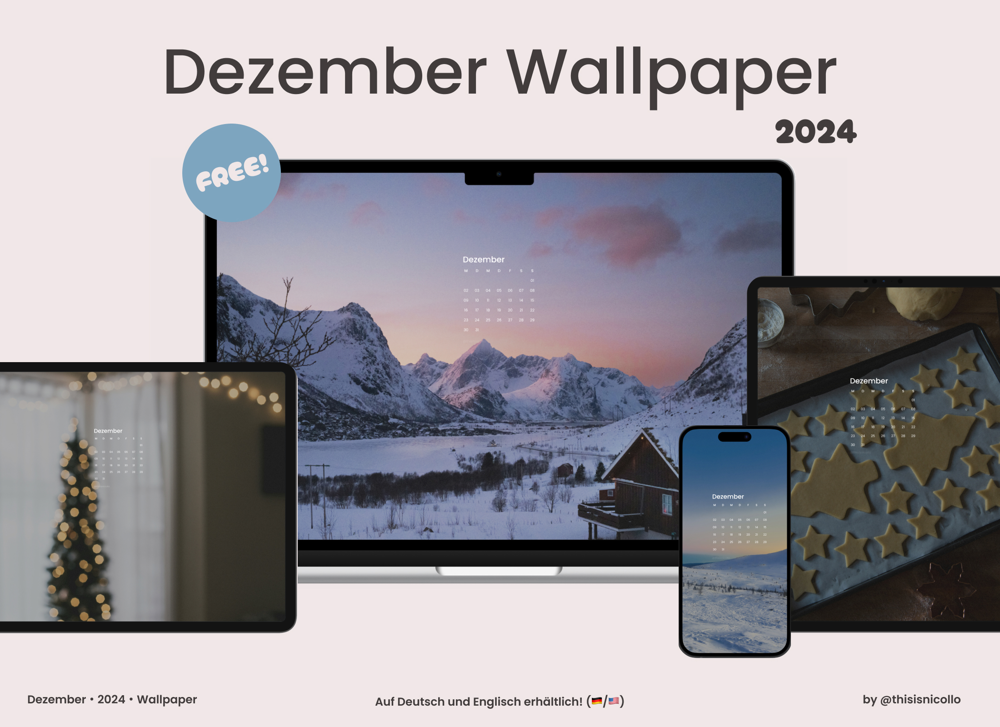

  

# November Release - Celebrate the Tranquil Fall 🌙🐿️

## 🖼️ November 2024 Wallpaper
🇩🇪
Der November bringt uns eine ruhige, besinnliche Zeit, in der die Natur sich in eine sanfte Palette aus warmen Erdtönen hüllt. 🌳🍂 Die ausgewählten Wallpaper zeigen beeindruckende Landschaften von Wäldern, majestätischen Bergen und stimmungsvollen Straßen, die durch herbstliche Wälder führen. 🌌🌙🌲

Wähle dein Lieblings-Wallpaper und lasse dich von der friedlichen Atmosphäre des Novembers verzaubern! 🍁✨

[⏬💗Wallpaper Vorschau](#wallpaper)  [⏬🇺🇸English below](#english)  

  

## 📥 Nutzung
Bitte beachte, dass die Nutzung der Bilder ausschließlich für die privatenutzung bestimmt ist. Jegliche kommerzielle Nutzung oder Weiterverbreitung der Bilder ist ohne ausdrückliche Genehmigung der Rechteinhaber untersagt.

**Download-Anleitung:**
1. Gehe rechts auf den folgenden Link [Hier Ende-zu-Ende-verschlüsselt downloaden (Proton Drive)](https://drive.proton.me/urls/6TTT677NV0#k5EdKtQtYp5R).
2. Entweder bestimmtes Wallpaper oder Ordner downloaden.
3. Entpacke die ZIP-Datei und verwende die enthaltenen Bilder als Hintergrund auf deinen Geräten.

Eine kurze Anleitung zum Downloaden findest du hier: [YouTube Tutorial](https://www.youtube.com/@thisisnicollo) 

  
   
  

## 📄 Hinweis
Logos und Marken in diesen Hintergrundbildern gehören ihren jeweiligen Eigentümern. Ich möchte klarstellen, dass ich keine Rechte oder Eigentumsansprüche an ihnen geltend mache. Die Bilder wurden mithilfe von KI erstellt und basieren auf meiner kreativen Vision. Diese Wallpaper sind perfekt geeignet, um deinen Desktop, dein Tablet oder dein Smartphone zu verschönern. 🙏 

Mir gehören lediglich der "Bär" und der Smiley, der auf einigen Wallpapern oder in den Vorschaubildern zu sehen ist. 🐻🙂
Ebenso gehört mir der Downloadbutton.

Die Nutzung der Wallpaper ist ausschließlich für private Zwecke bestimmt. Jegliche kommerzielle Nutzung oder Weiterverbreitung der Bilder ist ohne ausdrückliche Genehmigung der Rechteinhaber untersagt.

Kontaktiere mich bitte umgehend, wenn eine Kennzeichung erwünscht ist!
Ich möchte sicherstellen, dass alle Rechte Respektiert werden und darum die entsprechende Maßnahmen ergreifen oder auf wunsch das betreffende Bild entfernen.

Diese Sammlung wurde von [thisisnicollo](https://github.com/thisisnicollo) erstellt. 

 

## 🖥️ Alle Wallpaper
Die folgenden Vorschaubilder sind für Desktop, Samrtphone und Tablet erhältlich. Die Kalender auf Deutsch sowie auf Englisch erhältlich.  
[⏬💗Wallpaper Vorschau](#wallpaper)

# 🖼️ October 2024 Wallpaper

🇺🇸
November brings us a quiet, contemplative time when nature is wrapped in a soft palette of warm, earthy colours. 🌳🍂 The selected wallpapers present stunning landscapes of forests, majestic mountains and atmospheric roads through autumnal forests. 🌌🌙🌲

Choose your favourite wallpaper and be enchanted by the peaceful atmosphere of November! 🍁✨

 

  

 

## 📥 Usage
Please note that the use of the images is strictly for personal use only. Any commercial use or redistribution of the images is prohibited without the explicit permission of the copyright holders.

**Download instructions:**
1. go right to the following link [Download end-to-end encrypted here (Proton Drive)](https://drive.proton.me/urls/6TTT677NV0#k5EdKtQtYp5R).
2. download either specific wallpaper or folder.
3. unzip the ZIP file and use the contained images as wallpaper on your devices.

You can find a short download guide here: [YouTube Tutorial](https://www.youtube.com/@thisisnicollo) 

## 📄 Disclaimer
Logos and trademarks in these wallpapers belong to their respective owners. I want to make it clear that I do not claim any rights or ownership over them. The images were created using AI and are based on my creative vision. These wallpapers are perfect to beautify your desktop, tablet or phone. 🙏 

I only own the “bear” and the smiley that can be seen on some wallpapers or in the thumbnails. 🐻🙂
I also own the download button.

The use of the wallpapers is strictly for private purposes only. Any commercial use or redistribution of the images is prohibited without the explicit permission of the copyright holders.

Please contact me promptly if attribution is desired!
I want to ensure that all rights are respected and will take appropriate action or remove the relevant image upon request.

This collection were created by [thisisnicollo](https://github.com/thisisnicollo).

 

## 🖥️ All Wallpapers
The Wallpapers are available for desktop, phone and tablet. The calendars are available in German and English.

### 🖥️ Desktop

#### 🇩🇪 Deutsch

  
  
  
  
  
  
  

#### 🇺🇸 English

  
  
  
  
  
  
  

### 📱 Phone

#### 🇩🇪 Deutsch

  
  
  
  
  
  
  

#### 🇺🇸 English

  
  
  
  
  
  
  

### 📱 Tablet

#### 🇩🇪 Deutsch

  
  
  
  
  
  
  

#### 🇺🇸 English

  
  
  
  
  
  
  

